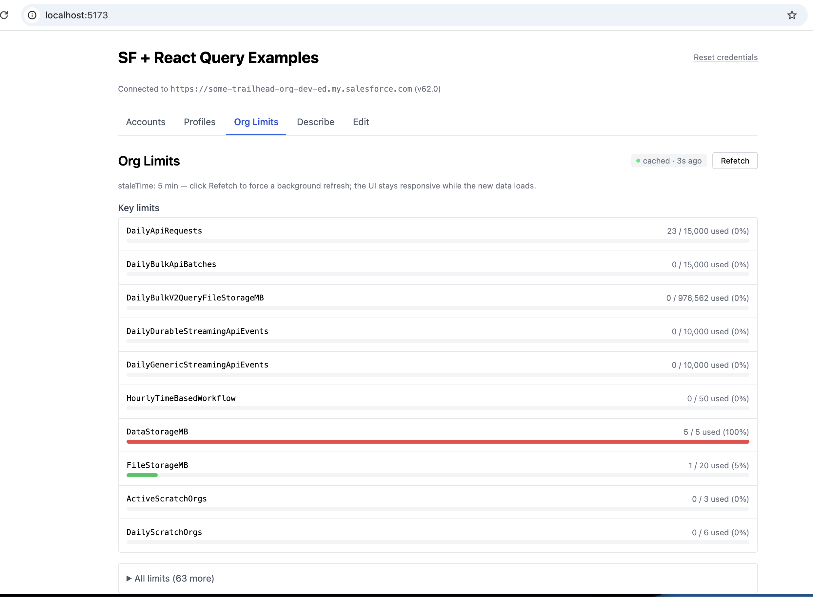

# Salesforce REST API — React Query / TanStack Query Hooks



[](LICENSE)
[](https://react.dev)
[](https://tanstack.com/query/v5)
[](https://www.typescriptlang.org)
[](https://bun.sh)

**TanStack Query v5 hooks for the Salesforce REST API** — SOQL pagination, SObject mutations with optimistic updates, describe, and limits. Copy any hook into your own app, or use this as a starter template.

Stack: **Bun** · Vite · React 18 · TanStack Query v5 · Zod · TypeScript · Tailwind CSS.

> [!WARNING]
> **Learning and code-organisation demo — not a production pattern.**
>
> - The UI accepts a plain-text access token held in page state. **Not safe** for real users or sensitive orgs.
> - The dev server uses a **Vite proxy** to work around Salesforce's CORS restrictions. This proxy does not exist in a production build — the app will not work as-is when deployed.
>
> For a production app you need OAuth 2.0 PKCE with a backend that handles token exchange and refresh. See the companion template: **[salesforce-oauth-pkce-hono-bun](https://github.com/ShriPunta/salesforce-oauth-pkce-hono-bun)**.

## Why this exists

While building [SFDevTools](https://www.sfdevtools.com) I leaned heavily on React Query — it made async Salesforce calls dramatically simpler and the app noticeably snappier. I couldn't find any existing hook libraries or seed repos targeting the Salesforce REST API, so I built this: a minimal, copy-paste-friendly reference for anyone learning TanStack Query against a well-structured REST API, or anyone who wants a head start on a real Salesforce app.

## What it demonstrates

- **Live cache visualisation** — every tab shows a `CacheBadge` indicating whether data came from cache or a fresh network request, making React Query's stale-while-revalidate behaviour visible without opening DevTools.
- **Generic base hooks** — one reusable hook per API shape (`useSOQLInfiniteQuery`, `useDescribeQuery`, `useUpdateSObjectMutation`); specific hooks are thin wrappers that pin the query and set an appropriate `staleTime`.
- **Full mutation example** — optimistic PATCH with automatic rollback on error.
- **Zero CORS config** — the dev server proxies all Salesforce requests, so you can point the app at any org with just a session token.

## Demos

| Tab | Hook | What it shows |
|-----|------|---------------|
| Accounts | `useSOQLInfiniteQuery` | Infinite SOQL + cursor pagination |
| Profiles | `useSOQLInfiniteQuery` | 24 h `staleTime` — instant cache hits on revisit |
| Org Limits | `useLimitsQuery` | REST API (non-SOQL) + background refetch |
| Describe | `useDescribeQuery` | SObject schema inspection |
| Edit | `useUpdateSObjectMutation` | Optimistic PATCH + rollback on error |

## Quickstart

```bash
bun install
bun run dev
```

Open the app and paste:

1. **Instance URL** — e.g. `https://yourorg.my.salesforce.com`
2. **Session token** — see below

Credentials are stored in `sessionStorage` only and never leave the browser outside of proxied API calls.

## Getting a session token

```bash
sf org display --target-org <alias>
```

Use the `Access Token` and `Instance Url` it prints. Tokens expire — re-run when you get 401s.

## CORS

The dev server includes a dynamic proxy. All `/sf-proxy/*` requests are forwarded server-side using the `X-SF-Instance` header to determine the target org — **no CORS configuration is needed in your Salesforce org** during local development.

In production you would either keep a backend proxy or allowlist your origin in **Setup → CORS**.

## Provider

```tsx
import { SFProvider } from "./provider";

<SFProvider
  getToken={() => mySessionToken}
  instanceUrl="https://yourorg.my.salesforce.com"
  apiVersion="v62.0"
>
  <App />
</SFProvider>
```

`getToken` may return a `Promise<string>` to support async token refresh.

## Hook organisation

```
src/hooks/
  soql/
    useSOQLInfiniteQuery.ts     ← base: any SOQL query with cursor pagination
    useAccountsQuery.ts         ← specific: Account records (staleTime 5 m)
    useProfilesQuery.ts         ← specific: Profile records (staleTime 24 h)
  api/
    useDescribeQuery.ts         ← sobjects/{Type}/describe (staleTime 30 m)
    useLimitsQuery.ts           ← /limits endpoint (staleTime 5 m)
  mutations/
    useUpdateSObjectMutation.ts ← PATCH with optimistic update + rollback
```

**Pattern:** one generic base hook per API shape, then thin wrappers that pin the query string and tune `staleTime` to how often the data actually changes. Adding a new SOQL-backed hook means copying `useAccountsQuery.ts` and changing the query.

## Layout

```
src/
  provider.tsx
  client.ts
  schemas.ts
  hooks/
    soql/
    api/
    mutations/
  examples/
    AccountList.tsx
    ProfileList.tsx
    OrgLimits.tsx
    DescribeViewer.tsx
    EditAccount.tsx
  components/
    CacheBadge.tsx
  App.tsx
  main.tsx
```

## License

MIT — Copyright (c) 2026 Shridhar Puntambekar.
